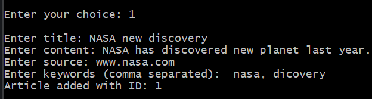
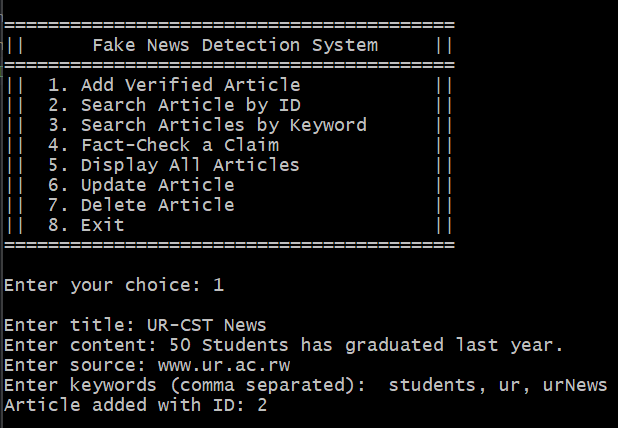

## 📘 Project Title:

**Fake News Detection System using Binary Search Tree (BST)**

## 📝 Project Overview:

The Fake News Detection System is a console-based C++ application that helps manage a collection of verified news articles using a Binary Search Tree (BST). The system supports adding, updating, deleting, and searching articles, and it allows users to check the validity of a claim based on keyword matching with existing articles.

## 🔧 Prerequisites

- A C++ compiler (e.g., `g++`)
- Compatible with C++11 or above
- Git installed (for cloning repository)
- Works on Windows, macOS, and Linux

## 📂 File Structure:

* `main.cpp`: Main program file containing all logic, class definitions, and the application menu.
* `articles.txt`: A text file where articles are persisted.

## 🧱 Key Components:

### 1. **Struct `NewsArticle`**

Represents a news article with:

* `id`: Unique article identifier
* `title`, `content`, `source`, `date`: Metadata
* `keywords`: Keywords for classification
* `display()` and `displayFormatted()` for showing article info
* `serialize()` and `deserialize()` for file I/O

### 2. **Struct `BSTNode`**

Defines a node in the BST with:

* `NewsArticle article`
* `left` and `right` pointers

### 3. **Function `getKeywords()`**

Prompts the user to enter comma-separated keywords and returns them as a vector.

## 🧠 Class: `NewsBST`

Handles all BST operations and business logic:

### 🔹 Private Members:

* `BSTNode *root`: Root node of the BST
* `int nextId`: Auto-incremented article ID
* Helper methods for:
  * Insert (`insertHelper`)
  * Search (`searchByIdHelper`)
  * Delete (`deleteNodeHelper`)
  * Traverse (`inOrderHelper`)
  * Search by keyword (`searchByKeywordHelper`)

### 🔹 Public Methods:

* `addArticle()`: Adds a new article to the BST
* `searchById(int)`: Returns an article pointer if found
* `searchByKeyword(string)`: Returns matching articles
* `getAllArticles()`: Returns all articles in sorted order
* `updateArticle(int)`: Modifies fields of an existing article
* `deleteArticle(int)`: Removes an article
* `factCheck(string)`: Matches keywords of a claim with stored articles
* `saveToFile()` and `loadFromFile()`: Handles persistence

## 🎯 Functional Features:

| Feature              | Description                                                                 |
| -------------------- | --------------------------------------------------------------------------- |
| Add Article          | Prompts for details and stores in BST                                       |
| Search by ID         | Retrieves a single article                                                  |
| Search by Keyword    | Returns a list of articles containing the keyword in title or keywords list |
| Fact-Check a Claim   | Checks a claim against stored articles using keyword comparison             |
| Display All Articles | Shows all articles in formatted manner                                      |
| Update Article       | Allows editing of title, content, source, and keywords                      |
| Delete Article       | Deletes a selected article                                                  |
| File I/O Support     | Saves and loads articles from `articles.txt` automatically                |

## 🔍 How Fact-Checking Works:

* Takes a user claim and extracts words >3 characters as potential keywords.
* Searches for these keywords in stored articles.
* Displays any matches or declares the claim possibly fake if none are found.

## 🧪 Sample Walkthrough

1. Start the application from the terminal.
2. Select `1` from the main menu to add an article.
3. Provide:
   - A title for the article
   - The full content/body
   - The news source
   - Relevant keywords (comma-separated)
4. Return to the menu and select `4` to fact-check a claim by typing it in.
5. The system will compare your claim's keywords against known articles.

## 💻 Usage

To set up and run the system on your local machine:

```bash
# Step 1: Clone the repository
git clone https://github.com/SilasHakuzwimana/fake-news-detection-system.git

# Step 2: Navigate into the project folder
cd fake-news-detection-system

# Step 3: Compile the program (Ensure g++ is installed)
g++ -o main main.cpp

# Step 4: Run the program
./main.exe
```

## 📸 Screenshot

*(Add a screenshot of the terminal UI output here if you have one)*





Adding second article for choice 5 showcase:




Display article to see if it's updated


Check if article is deleted


## 🔚 Conclusion:

This system is a simple but effective demo of how data structures like BSTs can be used to manage and retrieve structured data efficiently, with real-world application in verifying information. With keyword-based fact-checking, it offers a practical tool for identifying potential fake news.

## 👤 Author

**Silas Hakuzwimana**
GitHub: [@SilasHakuzwimana](https://github.com/SilasHakuzwimana)

## 📄 License

This project is licensed under the MIT License - see the [LICENSE](LICENSE) file for details.
